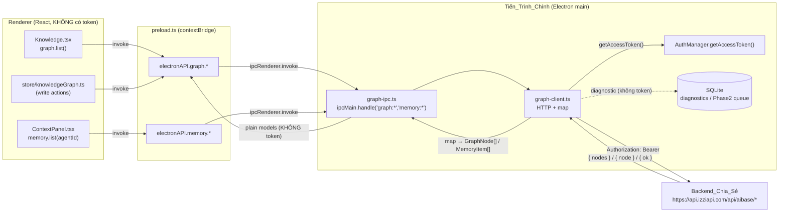

# Tài liệu Thiết kế — Desktop Graph & Memory Backend Sync

## Overview

Thiết kế kỹ thuật lấp khoảng trống phía **GHI** của "second brain" trên `apps/desktop`
(Electron + React 19 + Zustand): bổ sung cầu IPC `electronAPI.graph` + `electronAPI.memory`,
nối renderer (đang feature-detect, luôn rỗng) vào **Backend_Chia_Sẻ** `/api/aibase/*` tại
`https://api.izziapi.com` — nguồn sự thật duy nhất dùng chung với web izziapi.com.

Nguyên tắc xuyên suốt (Karpathy + second-brain steering):

- **Additive, không fork.** Tái dùng `AuthManager.getAccessToken()` cho token, mở rộng
  `SyncEngine` cho chu kỳ 5 phút, dùng đúng `ipcMain.handle` + `contextBridge` hiện có, ghi
  hàng đợi Phase 2 vào `DatabaseManager`/`ensureSqliteSchema` hiện có. Không tạo cơ chế auth,
  HTTP, hay store song song.
- **Một mô hình dữ liệu duy nhất.** `GraphNode`/`GraphLink` phản chiếu **đúng** `UserNode`/
  `UserLink` của backend (Req 1.3, 3.2). Không tạo cấu trúc lệch.
- **Token chỉ ở tiến trình main.** Mọi `fetch` tới `/api/aibase/*` nằm trong main; JWT không
  bao giờ đi qua cầu IPC (Req 7.3, 9.2).
- **Logic thuần, kiểm thử được.** Ánh xạ node/link (Phase 1) và hàng đợi offline (Phase 2) là
  hàm thuần, không Electron, không mạng → vitest + `fast-check`.
- **Phân pha rõ.** Phase 1 = lõi online-first buildable + testable (IPC, HTTP, mapper, wiring).
  Phase 2 = hàng đợi offline (bảng SQLite + coalesce/no-orphan/LWW) — phác thảo như module tách
  rời, **không** chi tiết tới mức triển khai.

Phạm vi neo theo sự thật đã kiểm chứng trong `requirements.md`: full CRUD backend đã tồn tại →
**không** thêm/đổi endpoint backend; chỉ xây phía desktop.

## Architecture

### Luồng dữ liệu (token không qua IPC)



Điểm mấu chốt: mũi tên token (`getAccessToken` → header) **chỉ tồn tại bên trong khối Main**.
Cầu IPC trả về duy nhất `GraphNode` / `GraphLink` / `MemoryItem` (dữ liệu không nhạy cảm).

### Vị trí trong kiến trúc hiện có

| Tầng | Tệp hiện có | Vai trò trong tính năng này |
|---|---|---|
| Auth | `main/auth/auth-manager.ts` | Cấp token qua `getAccessToken()` (tự refresh). **Không sửa.** |
| Sync | `main/sync/sync-engine.ts` | Poll 5 phút; Phase 1 gọi thêm refresh graph, Phase 2 flush hàng đợi. **Mở rộng.** |
| IPC bridge | `main/preload.ts` | Thêm namespace `graph` + `memory`. |
| IPC handlers | `main/index.ts` `setupIPC()` | Gọi `registerGraphIpc(...)` mới. |
| DB | `main/db/database.ts`, `db/sqlite-schema.ts` | Diagnostics (Phase 1) + bảng hàng đợi (Phase 2). |
| Renderer đọc | `renderer/pages/Knowledge.tsx`, `components/ContextPanel.tsx` | Nối vào dữ liệu thật. |
| Renderer chuẩn hoá | `renderer/types/agent-memory.ts` | `normalizeMemoryItems` — tái dùng nguyên trạng. |

### Bố cục tệp mới / sửa (cụ thể)

**Mới — logic thuần dùng chung (test không cần Electron):**

- `apps/desktop/src/shared/graph-types.ts` — `GraphNode`, `GraphLink`, `NodeCreatePayload`,
  `NodePatchPayload`, `MemoryItemDTO`. **Nguồn sự thật type duy nhất**, import được từ cả main lẫn renderer.
- `apps/desktop/src/shared/graph-mapper.ts` — hàm THUẦN: `userNodeToModel`, `userLinkToModel`,
  `modelToCreatePayload`, `modelToPatchPayload`, `memoryNodeToItem`. Own-property, không side-effect.

**Mới — tiến trình main:**

- `apps/desktop/src/main/graph/graph-client.ts` — lớp `GraphClient` (HTTP). Build Bearer header
  từ `AuthManager`, gọi `/api/aibase/*`, map qua `graph-mapper`, fail-closed/empty theo quy tắc lỗi,
  ghi diagnostic không-token.
- `apps/desktop/src/main/graph/graph-ipc.ts` — `registerGraphIpc(graphClient)` đăng ký các handler
  `graph:list|create|update|remove`, `graph:links`, `memory:list`.

**Mới — renderer:**

- `apps/desktop/src/renderer/store/knowledgeGraph.ts` — zustand store nhỏ (theo khuôn
  `agentWorkspace.ts`): `nodes`, `links`, `status`, `refresh()`, `createNode()`, `updateNode()`,
  `removeNode()`. Feature-detect `window.electronAPI?.graph`; cập nhật state từ phản hồi backend.

**Sửa (tối thiểu, additive):**

- `main/preload.ts` — thêm 2 namespace `graph` + `memory`.
- `main/index.ts` — khởi tạo `GraphClient` + gọi `registerGraphIpc`.
- `renderer/types/global.d.ts` — (tuỳ chọn) khai báo type `graph`/`memory` thay cho `any`.
- `renderer/pages/Knowledge.tsx` — đổi đúng **một** chỗ đọc trường `type` → `nodeType` để khớp
  `UserNode` (giữ nguyên feature-detect, empty-state, own-property).
- `renderer/components/ContextPanel.tsx` — **không đổi** (đã khớp `memory.list(agentId)` +
  `normalizeMemoryItems`).
- `main/sync/sync-engine.ts` — thêm bước refresh graph vào chu kỳ (giữ nguyên các bước cũ).

## Components and Interfaces

### 1. `shared/graph-types.ts` (mới) — nguồn sự thật type

```ts
/** Phản chiếu ĐÚNG UserNode của Backend_Chia_Sẻ (Req 1.3, 3.2). */
export interface GraphNode {
  id: string;
  title: string;
  nodeType: string;
  content?: string;
  url?: string;
  metadata?: Record<string, unknown>;
  color: string;
  parentId?: string;
  topicId?: string;
  x?: number;
  y?: number;
  createdAt: string;
  updatedAt: string;
}

/** Phản chiếu ĐÚNG UserLink. */
export interface GraphLink {
  id: string;
  sourceId: string;
  targetId: string;
  label?: string;
  color?: string;
}

/** Trường Backend_Chia_Sẻ chấp nhận khi POST /api/aibase/nodes. */
export interface NodeCreatePayload {
  title: string;                 // bắt buộc, không rỗng (Req 2.1, 2.2)
  nodeType?: string;
  color?: string;
  content?: string;
  url?: string;
  topicId?: string;
  x?: number;
  y?: number;
  metadata?: Record<string, unknown>;
}

/** Whitelist PATCH /api/aibase/nodes/:id (Req 2.3). */
export interface NodePatchPayload {
  title?: string;
  nodeType?: string;
  color?: string;
  content?: string;
  url?: string;
  x?: number;
  y?: number;
  topicId?: string;
  isPublic?: boolean;
  metadata?: Record<string, unknown>;
}

/** Item bộ nhớ phẳng trả qua IPC; renderer normalize tiếp (Req 8.2). */
export interface MemoryItemDTO {
  id: string;
  title: string;
  source: string;
  createdAt: string;
}
```

### 2. `shared/graph-mapper.ts` (mới) — hàm THUẦN

```ts
import type {
  GraphNode, GraphLink, NodeCreatePayload, NodePatchPayload, MemoryItemDTO,
} from './graph-types';

/** JSON backend (unknown) → GraphNode | null. Own-property; null nếu thiếu id/title. */
export function userNodeToModel(raw: unknown): GraphNode | null;

/** JSON backend (unknown) → GraphLink | null. Null nếu thiếu id/sourceId/targetId. */
export function userLinkToModel(raw: unknown): GraphLink | null;

/** GraphNode (hoặc input tạo) → body POST (chỉ trường create chấp nhận). */
export function modelToCreatePayload(model: Partial<GraphNode> & { title: string }): NodeCreatePayload;

/** GraphNode (một phần) → body PATCH (chỉ whitelist; bỏ trường undefined). */
export function modelToPatchPayload(model: Partial<GraphNode> & { isPublic?: boolean }): NodePatchPayload;

/** Node bộ nhớ (unknown) → MemoryItemDTO | null. source = nodeType; null nếu thiếu trường. */
export function memoryNodeToItem(raw: unknown): MemoryItemDTO | null;
```

Quy tắc (đảm bảo Req 1.6, 9.3 — **own-property, không prototype-chain**; theo đúng khuôn
`normalizeMemoryItems` đã có):

- Mọi hàm đọc dùng `Object.hasOwn(obj, key)` + kiểm `typeof` trước khi lấy giá trị; input không
  hợp lệ → bỏ qua/`null`, **không** ném lỗi, **không** bịa dữ liệu.
- `modelToCreatePayload` / `modelToPatchPayload` chỉ copy các khoá thuộc whitelist, **bỏ** khoá
  `undefined` (không gửi trường rỗng thừa).
- `id`, `createdAt`, `updatedAt`, `parentId` là **server-owned** → không nằm trong payload ghi.
- `memoryNodeToItem`: `id←id`, `title←title`, `createdAt←createdAt`, `source←nodeType` (nếu thiếu
  → trả `null`; renderer `normalizeMemoryItems` lọc tiếp no-orphan).

### 3. `main/graph/graph-client.ts` (mới) — tầng HTTP

```ts
export class GraphClient {
  constructor(private auth: AuthManager, private db: DatabaseManager) {}

  async listNodes(): Promise<GraphNode[]>;                       // GET  /api/aibase/nodes
  async createNode(input: NodeCreateInput): Promise<GraphNode | { error: string }>; // POST
  async updateNode(id: string, patch: Partial<GraphNode>): Promise<GraphNode | { error: string }>; // PATCH
  async removeNode(id: string): Promise<{ ok: boolean; error?: string }>;           // DELETE
  async listLinks(): Promise<GraphLink[]>;                       // GET  /api/aibase/links
  async listMemory(limit?: number): Promise<MemoryItemDTO[]>;    // GET  /api/aibase/memory/list?limit=N
}
```

Hành vi chuẩn (mọi method, khớp `SyncEngine` về cách build header):

1. `const token = await this.auth.getAccessToken();`
2. `token == null` → **đọc**: trả `[]` và **không** gọi backend (Req 1.4); **ghi**: trả
   `{ error }`, fail-closed (Req 9.5), không gọi backend.
3. Gọi `fetch` tới `${IZZI_API_BASE}/api/aibase/...` với headers `Content-Type: application/json` +
   `Authorization: Bearer ${token}`. `IZZI_API_BASE` lấy đúng như AuthManager/SyncEngine.
4. `res.status === 401` → fail-closed: đọc trả `[]`, ghi trả `{ error: 'unauthorized' }`; **không**
   thử lại đường vòng không xác thực (Req 9.5).
5. Lỗi mạng/`!res.ok` khác → đọc trả `[]` (Req 1.5); ghi truyền nguyên trạng lỗi/quyền của backend
   về renderer (Req 2.6).
6. Thành công → map qua `graph-mapper` (`userNodeToModel`/`userLinkToModel`/`memoryNodeToItem`),
   lọc `null`, trả mảng/đối tượng model.
7. Ghi `appendDiagnosticEvent({ type: 'graph.*', ... })` cho lỗi — **chỉ** status/message ngắn,
   **không** token, **không** nội dung node kèm danh tính (Req 9.2, 9.4).

`createNode` kiểm `title` rỗng/whitespace **trước** khi gọi (Req 2.2) → trả `{ error }` ngay.

### 4. `main/graph/graph-ipc.ts` (mới) — đăng ký handler

```ts
export function registerGraphIpc(client: GraphClient): void {
  ipcMain.handle('graph:list',   () => client.listNodes());
  ipcMain.handle('graph:create', (_e, input) => client.createNode(input));
  ipcMain.handle('graph:update', (_e, id, patch) => client.updateNode(id, patch));
  ipcMain.handle('graph:remove', (_e, id) => client.removeNode(id));
  ipcMain.handle('graph:links',  () => client.listLinks());
  ipcMain.handle('memory:list',  (_e, _agentId, limit) => client.listMemory(limit));
}
```

Gọi từ `index.ts` `setupIPC()` (sau khối `// ── Sync ──`):
```ts
const graphClient = new GraphClient(authManager, db);
registerGraphIpc(graphClient);
```
`memory:list` nhận `_agentId` để khớp chữ ký feature-detect (Req 7.5); backend không lọc theo
agent nên tham số là gợi ý, hiện chưa dùng — ghi chú rõ trong code.

### 5. `main/preload.ts` (sửa) — thêm namespace

```ts
  graph: {
    list:   (): Promise<GraphNode[]> => ipcRenderer.invoke('graph:list'),
    create: (input: NodeCreateInput) => ipcRenderer.invoke('graph:create', input),
    update: (id: string, patch: Partial<GraphNode>) => ipcRenderer.invoke('graph:update', id, patch),
    remove: (id: string) => ipcRenderer.invoke('graph:remove', id),
    links:  (): Promise<GraphLink[]> => ipcRenderer.invoke('graph:links'),
  },
  memory: {
    list: (agentId: string, limit?: number): Promise<MemoryItemDTO[]> =>
      ipcRenderer.invoke('memory:list', agentId, limit),
  },
```

`graph.list()` trả mảng node (khớp `Knowledge.tsx`), `memory.list(agentId)` trả mảng item (khớp
`ContextPanel.tsx`) — Req 7.5.

### 6. `renderer/store/knowledgeGraph.ts` (mới) — store ghi (theo khuôn `agentWorkspace.ts`)

```ts
interface KnowledgeGraphState {
  nodes: GraphNode[];
  links: GraphLink[];
  status: 'idle' | 'loading' | 'ready' | 'empty';
  refresh: () => Promise<void>;                                   // graph.list + graph.links
  createNode: (input: NodeCreateInput) => Promise<GraphNode | null>;
  updateNode: (id: string, patch: Partial<GraphNode>) => Promise<boolean>;
  removeNode: (id: string) => Promise<boolean>;
}
```

- Mọi action feature-detect `window.electronAPI?.graph` → thiếu thì giữ rỗng (Req 10.1).
- Sau ghi thành công: cập nhật `nodes` **từ phản hồi backend** (id thật + trường trả về), không từ
  giá trị giả định client (Req 3.1); sau đó `refresh()` để khớp nguồn sự thật (Req 3.3).
- Ghi bị từ chối: giữ state nhất quán, **không** hiển thị thay đổi đã fail là thành công (Req 3.4).
- Đọc field từ model bằng own-property (Req 9.3).

Phase 1 dùng store cho **đường ghi** (sẵn cho UI sửa node sau này). Hiển thị đọc của
`Knowledge.tsx` giữ pattern gọi trực tiếp `graph.list()` hiện có (đủ cho empty/ready state) — store
có thể tiếp quản khi thêm UI biên tập.

### 7. Wiring renderer (tối thiểu)

- **`Knowledge.tsx`**: giữ nguyên feature-detect + empty-state + vòng lặp own-property. Sửa **một
  dòng** ở nhánh thành công: đọc `Object.hasOwn(item,'nodeType') ? String(item.nodeType)` thay cho
  `'type'`, và import `GraphNode` từ `shared/graph-types` để bỏ interface cục bộ lệch tên. Không đổi
  hành vi trạng thái (Req 10.1).
- **`ContextPanel.tsx`**: không đổi. IPC trả `MemoryItemDTO[]` đã đúng `{id,title,source,createdAt}`
  nên `normalizeMemoryItems` chạy như cũ (Req 8.1, 8.2, 10.1).

### 8. `main/sync/sync-engine.ts` (mở rộng, giữ nguyên hành vi cũ)

Thêm **một bước** vào `startSync()` (sau billing): gọi `graphClient.listNodes()` và cache kết quả
(qua `db.cacheUserData('graph_nodes','graph_nodes', ...)`), giữ nguyên 5 bước profile/keys/usage/
billing/refreshProfile + chu kỳ 5 phút (Req 5.4, 10.3). Phase 2 chèn thêm bước flush hàng đợi.

## Data Models

### Ánh xạ trường UserNode ↔ GraphNode ↔ payload ghi

| Trường | GraphNode | UserNode (BE) | CreatePayload | PatchPayload | Ghi chú |
|---|---|---|---|---|---|
| id | ✓ | ✓ | — | — | server-owned |
| title | ✓ | ✓ | ✓ (bắt buộc) | ✓ | không rỗng |
| nodeType | ✓ | ✓ | ✓ | ✓ | |
| content | ✓? | ✓? | ✓ | ✓ | |
| url | ✓? | ✓? | ✓ | ✓ | |
| metadata | ✓? | ✓? | ✓ | ✓ | object |
| color | ✓ | ✓ | ✓ | ✓ | |
| parentId | ✓? | ✓? | — | — | server-owned |
| topicId | ✓? | ✓? | ✓ | ✓ | |
| x, y | ✓? | ✓? | ✓ | ✓ | toạ độ |
| isPublic | — | (BE) | — | ✓ | chỉ patch |
| createdAt | ✓ | ✓ | — | — | server-owned |
| updatedAt | ✓ | ✓ | — | — | dùng cho LWW (Phase 2) |

**Trường "được giữ" (writable round-trip — neo cho Property 1):** `title, nodeType, color,
content, url, x, y, topicId, metadata` — giao của create + patch (trừ `isPublic` không có trên model
đọc, trừ các trường server-owned). Property 1 bảo vệ chính tập này khỏi drift.

### GraphLink (Phase 1 — đồng bộ + lộ qua IPC, chưa có UI sửa)

`{ id, sourceId, targetId, label?, color? }` — phản chiếu `UserLink`. Phase 1 chỉ `graph.links()`
(đọc) để renderer/hàng đợi kiểm Bất_Biến_No_Orphan; UI biên tập link để phase sau (Quyết định 4).

### Bảng hàng đợi offline (Phase 2 — phác thảo, thêm vào `ensureSqliteSchema`)

```sql
CREATE TABLE IF NOT EXISTS offline_queue (
  seq         INTEGER PRIMARY KEY AUTOINCREMENT,  -- thứ tự FIFO cục bộ
  op_type     TEXT NOT NULL,                       -- 'create' | 'update' | 'delete'
  target      TEXT NOT NULL,                       -- 'node' | 'link'
  local_id    TEXT,                                -- id tạm khi chưa có id backend
  backend_id  TEXT,                                -- id backend nếu đã biết
  payload     TEXT NOT NULL,                       -- JSON trường thay đổi
  created_at  TEXT NOT NULL DEFAULT (datetime('now'))
);
CREATE INDEX IF NOT EXISTS idx_offline_queue_seq ON offline_queue(seq ASC);
```

Đây là phác thảo Phase 2; chi tiết flush/coalesce/LWW ở mục "Phase 2 sketch" cuối tài liệu, đủ để
thấy nó **bolt-on** lên hợp đồng IPC Phase 1 mà không reshape nó.

## Bảo mật (Security — security-baseline A/B/C/D)

| Yêu cầu | Cơ chế trong thiết kế | Req |
|---|---|---|
| Token chỉ ở main | `getAccessToken()` gọi trong `GraphClient`; IPC chỉ trả model, không token | 7.3, 9.2 |
| Không secret vào SQLite/log | Diagnostic chỉ ghi type/status/message ngắn; không token, không node-kèm-danh-tính | 9.2, 9.4 |
| Auth fail-closed | `token==null` hoặc 401 → đọc trả `[]`, ghi trả `{error}`; không retry vô danh | 9.5, 1.4 |
| Bề mặt ghi có auth | Mọi ghi đi qua `/api/aibase/*` (Bearer JWT, billing/limit ở backend); không tạo bề mặt ghi vô danh | 9.1 |
| Own-property access | `graph-mapper` + `normalizeMemoryItems` dùng `Object.hasOwn`, không prototype-chain | 9.3, 1.6 |
| Quyền do backend thực thi | Ghi node/link không thuộc user → truyền nguyên trạng kết quả từ chối của backend | 2.6 |
| TLS + Bearer | `https://api.izziapi.com`, token chỉ ở header `Authorization: Bearer` | 6.4 |

> SECURITY GATE: A (secret/config), B (auth/authz), C (input). Rủi ro chính: rò token qua IPC,
> tạo bề mặt ghi thiếu auth, prototype-pollution khi đọc JSON lạ. Thiết kế đóng cả ba bằng
> token-in-main, fail-closed, own-property. Quyết định: proceed (không chạm backend, không deploy).


## Correctness Properties

*Một property là đặc tính/hành vi phải đúng trên mọi lần thực thi hợp lệ của hệ thống — một
phát biểu hình thức về điều phần mềm PHẢI làm. Property là cầu nối giữa đặc tả đọc-được-bởi-người
và bảo đảm đúng-đắn kiểm-chứng-được-bởi-máy.*

Sau prework, bốn property dưới đây là phần logic **thuần** đáng kiểm bằng property-based testing.
Các tiêu chí còn lại (HTTP, IPC, store, regression) là INTEGRATION/EXAMPLE/SMOKE — xem Testing
Strategy. Quy ước repo: `fast-check`, `{ numRuns: 100 }`, chú thích
`// Feature: desktop-graph-backend-sync, Property N: ...`.

### Property 1: Ánh xạ node round-trip giữ nguyên trường được giữ (Phase 1)

*For any* node JSON hợp lệ từ Backend_Chia_Sẻ, ánh xạ `userNodeToModel(json)` → `GraphNode` →
`modelToPatchPayload(model)` → dựng lại model cho ra giá trị **tương đương trên tập trường được
giữ** (`title, nodeType, color, content, url, x, y, topicId, metadata`); đồng thời payload chỉ
chứa khoá thuộc whitelist và mọi truy cập trường là own-property (không theo prototype-chain).

**Validates: Requirements 1.2, 1.3, 2.3, 11.1**

### Property 2: Hợp nhất hàng đợi là idempotent (Phase 2)

*For any* Hàng_Đợi_Offline `q`, hợp nhất hai lần cho cùng kết quả như hợp nhất một lần:
`coalesce(coalesce(q)) == coalesce(q)`.

**Validates: Requirements 4.3, 11.2**

### Property 3: Hợp nhất không làm tăng số thao tác (Phase 2)

*For any* Hàng_Đợi_Offline `q`, số thao tác sau hợp nhất không lớn hơn trước:
`len(coalesce(q)) <= len(q)`.

**Validates: Requirements 4.3, 11.3**

### Property 4: Bất biến no-orphan của hàng đợi (Phase 2)

*For any* Hàng_Đợi_Offline `q` và tập id node đã biết `K` (tồn tại trên Backend_Chia_Sẻ hoặc nằm
trong `q`), mọi thao tác **link** được chọn để gửi đều có **cả** `sourceId` lẫn `targetId` resolve
được trong `K`; link tham chiếu node chưa khả dụng bị giữ lại (không gửi).

**Validates: Requirements 4.4, 4.7, 11.4**

## Error Handling

| Tình huống | Xử lý | Req |
|---|---|---|
| `getAccessToken()` trả null (đọc) | Trả `[]`, **không** gọi backend | 1.4 |
| `getAccessToken()` trả null (ghi) | Trả `{ error }`, fail-closed, không gọi backend | 9.5 |
| Backend 401 | Đọc → `[]`; ghi → `{ error:'unauthorized' }`; **không** retry vô danh | 9.5 |
| Lỗi mạng / `!res.ok` (đọc) | Trả `[]`, ghi diagnostic không-token, không throw | 1.5 |
| Ghi bị từ chối quyền (403…) | Truyền nguyên trạng kết quả backend về renderer | 2.6, 3.4 |
| `title` rỗng/whitespace khi create | `{ error }` ngay, không gọi backend | 2.2 |
| JSON node/link/memory dị dạng | Mapper trả `null` → lọc bỏ, không bịa, không throw | 1.6, 8.4, 9.3 |
| `electronAPI.graph`/`memory` thiếu | Renderer giữ empty-state feature-detect cũ | 10.1 |
| Nguồn memory lỗi/rỗng | Empty state hợp lệ, không bịa dữ liệu | 8.4 |
| (Phase 2) update node đã xoá trên BE | Loại op + ghi diagnostic | 4.6 |

Mọi diagnostic chỉ chứa type/status/message ngắn — **không** token, **không** node-kèm-danh-tính
(Req 9.2, 9.4).

## Testing Strategy

**Thư viện:** vitest (đã dùng trong repo) + `fast-check` cho property test. **Không** tự viết PBT
từ đầu. Mỗi property test cấu hình `{ numRuns: 100 }` và mang chú thích
`// Feature: desktop-graph-backend-sync, Property N: ...`.

### Property tests (1 test/property)

| Test | File | Phase |
|---|---|---|
| P1 — mapper round-trip giữ trường + whitelist + own-property | `shared/graph-mapper.test.ts` | 1 |
| P2 — coalesce idempotence | `shared/offline-queue.test.ts` | 2 |
| P3 — coalesce len ≤ | `shared/offline-queue.test.ts` | 2 |
| P4 — no-orphan invariant | `shared/offline-queue.test.ts` | 2 |

Generator P1: `fc` arbitrary dựng `UserNode` JSON (chuỗi unicode cho title/content, số cho x/y,
object cho metadata, optional fields), **kèm** ca prototype-polluted để khẳng định own-property.

### Unit / example tests (Phase 1)

- `graph-client.test.ts` (mock `fetch` + `AuthManager`): token null → `[]` không gọi BE (1.4);
  401 → fail-closed (9.5); lỗi mạng → `[]` + diagnostic không-token (1.5, 9.2); create title rỗng →
  `{error}` không gọi BE (2.2); header `Authorization: Bearer` + base https, token không lộ chỗ khác
  (6.4, 7.3); POST/PATCH body đúng whitelist (2.1, 2.3); 403 truyền nguyên trạng (2.6).
- `knowledgeGraph.store.test.ts`: write thành công → state lấy id từ phản hồi (3.1); refresh → khớp
  list mock (3.3); `{error}` → state không đổi (3.4); thiếu `electronAPI.graph` → rỗng + no-op (6.3, 10.1).
- IPC return không chứa khoá token/accessToken (7.3, 7.4).

### Regression (đã có — phải tiếp tục xanh, Req 10.5)

`agent-memory.test.ts`, `navigationMap.test.ts`, `electronWindowConfig.test.ts`,
`inlineStyleAudit.test.ts`, `glassTokens.test.ts` + smoke store hiện có. `ContextPanel.tsx` không
đổi nên test empty-state cũ giữ nguyên. `Knowledge.tsx` đổi một dòng field → cập nhật assertion nếu
có (giữ empty-state).

### Integration / smoke (cần mạng thật — 1–3 ví dụ, Req 11.6)

- **Cross-device smoke (thủ công/Playwright):** đăng nhập desktop → tạo node → mở web
  `https://izziapi.com/aibase/graph`, reload → node xuất hiện (Req 5.2). Sửa trên web → desktop
  refresh → thay đổi hiện (Req 5.3).
- **Build gate:** `pnpm --filter @openclaw/desktop build` thành công, không lỗi mới (Req 10.4).
- **Test gate:** `pnpm --filter @openclaw/desktop test` (vitest run) — 0 fail mới, skip không tăng (Req 10.5).

## Phase 2 — Sketch (hàng đợi offline; module tách rời, không chi tiết tới mức triển khai)

> Mục tiêu của sketch: chứng minh Phase 2 **bolt-on** lên hợp đồng IPC Phase 1 mà **không** reshape
> nó. Chi tiết thuật toán để spec/PR Phase 2.

**Ranh giới module (thuần):** `apps/desktop/src/shared/offline-queue.ts`

```ts
export type QueueOp = {
  seq: number;
  opType: 'create' | 'update' | 'delete';
  target: 'node' | 'link';
  localId?: string;
  backendId?: string;
  payload: Record<string, unknown>;
  createdAt: string;
};

/** Gộp update cùng node; triệt tiêu create-rồi-delete chưa tới BE. THUẦN. (P2, P3) */
export function coalesce(q: QueueOp[]): QueueOp[];

/** Lọc link op gửi được: cả 2 đầu resolve trong knownNodeIds. THUẦN. (P4) */
export function sendableLinkOps(q: QueueOp[], knownNodeIds: ReadonlySet<string>): QueueOp[];

/** LWW theo updatedAt của backend. THUẦN. (Req 4.5) */
export function resolveConflict(localUpdatedAt: string, backendUpdatedAt: string): 'local' | 'backend';
```

**Điểm bolt-on (không đổi Phase 1):**

- **Lưu:** bảng `offline_queue` thêm vào `ensureSqliteSchema` (idempotent, theo khuôn các bảng hiện
  có) + vài helper `enqueue/peek/dequeue` trong `DatabaseManager`. Không đổi schema cũ.
- **Phát hiện offline:** dựa trên kết quả `fetch` trong `GraphClient` (lỗi mạng ⇒ offline) + gợi ý
  `navigator.onLine` ở renderer — **không** thêm health-check (Quyết định 5). Khi `GraphClient` ghi
  thất bại vì offline → `enqueue` thay vì `{error}`; hợp đồng IPC `graph.create/update/remove` giữ
  nguyên (renderer không cần biết online/offline).
- **Flush:** `SyncEngine.startSync()` thêm bước cuối: nếu online, `coalesce(queue)` →
  `sendableLinkOps` → gửi FIFO theo `seq` → áp `resolveConflict` khi BE phản hồi `updatedAt` mới hơn;
  op nhắm node đã xoá → drop + diagnostic (Req 4.6). Giữ nguyên 5 bước sync cũ + chu kỳ 5 phút.

Vì `GraphClient` và hợp đồng IPC không đổi, Phase 2 chỉ là: 1 bảng SQLite + 1 module thuần +
1 bước trong `SyncEngine`. Logic thuần (`coalesce`/`sendableLinkOps`) kiểm bằng P2/P3/P4 mà không
cần mạng.

## Verification Plan (tóm tắt)

1. **Unit + property (vitest):** P1 round-trip (Phase 1, bắt buộc xanh); `graph-client` + store
   example tests; P2/P3/P4 khi làm Phase 2.
2. **Build:** `pnpm --filter @openclaw/desktop build` — 0 lỗi mới.
3. **Regression:** `vitest run` — 0 fail mới, skip không tăng (Req 10.5).
4. **Cross-device smoke (thủ công):** desktop tạo node → web `/aibase/graph` reload → node xuất hiện.
5. **Security self-check:** không token trong diff/log/diagnostic; bề mặt ghi mới đi qua Bearer JWT;
   own-property access; fail-closed 401.
