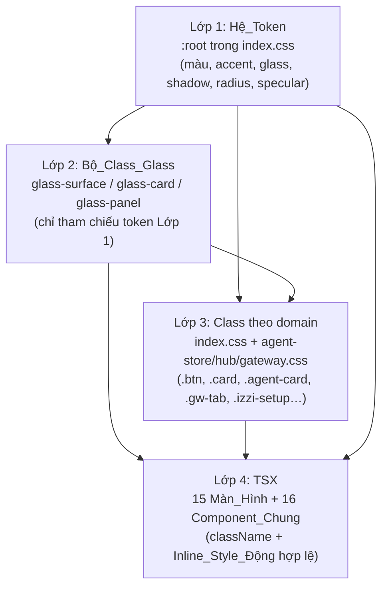
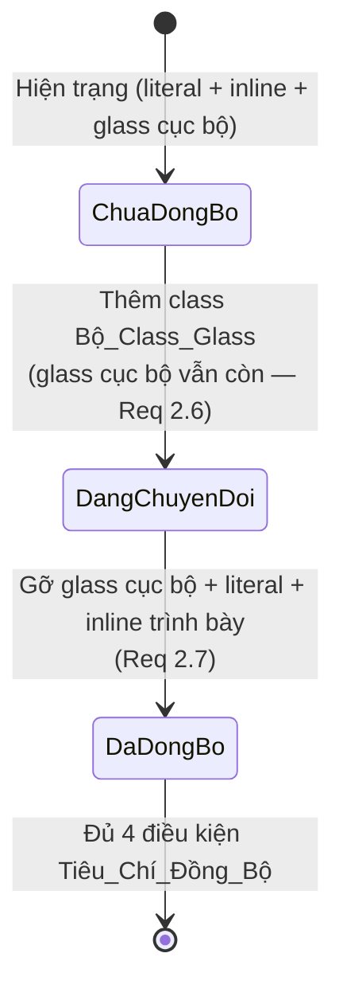
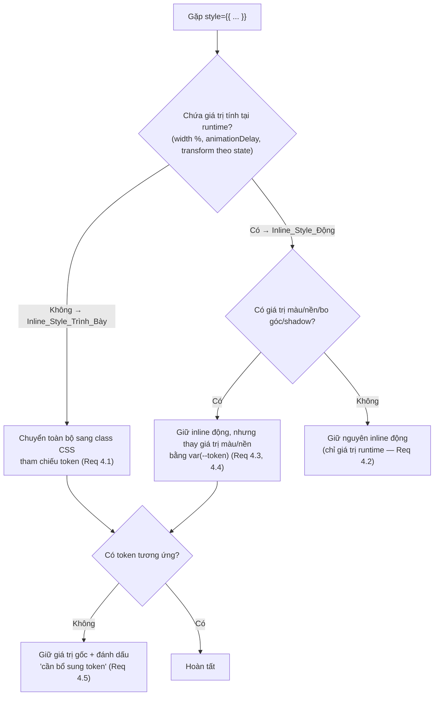

# Tài liệu Thiết kế

## Overview

Tài liệu này mô tả thiết kế kỹ thuật cho việc thiết kế lại giao diện renderer của `apps/desktop` theo phong cách "liquid glass" iOS 26, theo **Phương án B — "Token + Hợp nhất toàn bộ"** đã được chốt trong `requirements.md`.

Mục tiêu kỹ thuật cốt lõi **không phải** là viết lại UI, mà là **tập trung hóa và đồng bộ hóa** hệ thống style hiện đang phân mảnh ở ba nơi:

1. **Một nguồn token duy nhất** (`index.css :root`) được làm mới để mang ngôn ngữ thị giác iOS 26 (blur sâu hơn, bo góc lớn kiểu iOS, shadow mềm nhiều lớp, specular highlight viền sáng).
2. **Một bộ class kính dùng chung** (`glass-surface`, `glass-card`, `glass-panel`) thay cho việc lặp lại khối khai báo `background + backdrop-filter + border + border-radius` đang bị copy ở `.stat-card`, `.card`, `.ext-card`, `.login-card`...
3. **Hợp nhất ba stylesheet lệch màu** (`agent-store.css`, `agent-hub.css`, `agent-gateway.css`) về hệ token chung.
4. **Gỡ inline style trình bày** trong 15 Màn_Hình và 16 Component_Chung về class/token.

### Bối cảnh mã nguồn thực tế (đã khảo sát)

Việc khảo sát mã nguồn renderer cho thấy hiện trạng cụ thể mà thiết kế phải xử lý:

- **`index.css` (≈5045 dòng)** đã có khối `:root` token khá đầy đủ về màu, accent, spacing, radius, transition, nhưng **thiếu** các Token_Glass kiểu iOS 26: chưa có token specular highlight, chưa có token shadow nhiều lớp riêng cho kính, chưa có token bán kính lớn 20–32px và token bán kính nhỏ 8–16px chuyên cho bề mặt kính.
- Mẫu bề mặt kính `background: var(--glass-bg); backdrop-filter: var(--glass-blur); border: var(--glass-border); border-radius: var(--radius-lg);` **bị lặp lại** ở `.stat-card`, `.card`, `.ext-card`, `.login-card` — đây chính là phần Bộ_Class_Glass sẽ gom lại.
- **`agent-store.css`** là tệp lệch nặng nhất, dùng bảng slate/indigo hardcode (`#1e293b`, `#6366f1`, `#64748b`, `#3b82f6`, `#8b5cf6`, `#94a3b8`, `#e2e8f0`, `rgba(30,41,59,…)`, `rgba(71,85,105,…)`…). **`agent-hub.css`** và **`agent-gateway.css`** chủ yếu dùng literal cyan thương hiệu (`#67e8f9`) và thang `rgba(255,255,255,x)` thay vì token.
- Số đếm thực tế của 8 giá trị hex slate/indigo trong ba tệp lệch: `#6366f1`×12, `#64748b`×11, `#8b5cf6`×5, `#3b82f6`×3, `#1e293b`×2, `#475569`×1 (tổng 34 lần xuất hiện), cộng nhiều giá trị `rgba()` slate/indigo khác.
- **Inline style**: tổng ≈96 vị trí `style={{` trong phạm vi 15 page + 16 component; tập trung ở `Extensions.tsx` (26), `Marketplace.tsx` (22), `DeveloperDashboard.tsx` (10), `AgentSetupPanel.tsx` (9). Một phần là Inline_Style_Động (`width: ${percent}%`, `animationDelay: ${i*60}ms`) phải giữ nguyên.
- **Điều hướng** trong `App.tsx` dùng `useState<Page>` với 11 giá trị (`chat`, `tasks`, `memory`, `status`, `dashboard`, `marketplace`, `agents`, `extensions`, `settings`, `setup`, `costs`). `ExtensionDetail`, `DeveloperUpload`, `DeveloperDashboard` là **sub-view** dựng bên trong `Marketplace.tsx` bằng state cục bộ; `AgentStore` ứng với page `agents`; `Login` và `SetupWizard` được dựng riêng ngoài luồng sidebar.
- **Cấu hình cửa sổ Electron** (`src/main/index.ts`): `frame: false`, `titleBarStyle: 'hidden'`, `backgroundColor: '#0a0a0f'`, **không** bật `vibrancy`, **không** bật `transparent`. Thiết kế tuyệt đối không đụng tới các thuộc tính này.
- Các class `glass-surface` / `glass-card` / `glass-panel` **chưa tồn tại** trong mã nguồn — đây là phần tạo mới.

### Nguyên tắc thiết kế

- **Surgical & không hồi quy**: chỉ đổi thuộc tính trình bày (màu, blur, bo góc, shadow, khoảng cách). Không đổi cấu trúc DOM, không đổi tên class đang bị JS/TSX tham chiếu, không đổi luồng điều hướng, không thêm React primitive mới.
- **Một nguồn sự thật**: mọi giá trị màu/kính phải tham chiếu Hệ_Token; không còn literal nằm ngoài khối token.
- **Đo được**: mỗi Màn_Hình/Component có Tiêu_Chí_Đồng_Bộ 4 điều kiện kiểm bằng tìm kiếm văn bản và rà soát thủ công.
- **Hiệu năng & tương phản là ràng buộc cứng**: ≤3 lớp `backdrop-filter` chồng nhau, blur kẹp ≤24px, tương phản chữ ≥4.5:1 (chữ thường) / ≥3:1 (chữ lớn).

## Architecture

### Kiến trúc phân lớp style

Thiết kế tổ chức style thành bốn lớp, dòng chảy phụ thuộc chỉ đi **một chiều từ trên xuống** (lớp dưới tham chiếu lớp trên, không ngược lại):



- **Lớp 1 — Hệ_Token** là nguồn sự thật duy nhất. Mọi giá trị màu/kính/shadow/radius literal phải được nâng lên đây.
- **Lớp 2 — Bộ_Class_Glass** là API trình bày dùng chung; chỉ được phép tham chiếu token Lớp 1, không chứa literal (Req 2.8).
- **Lớp 3 — Class theo domain** kế thừa token và (khi là bề mặt kính) áp Bộ_Class_Glass thay vì khai báo lại thuộc tính kính.
- **Lớp 4 — TSX** chỉ gắn `className`; inline style chỉ còn lại loại Inline_Style_Động và bắt buộc tham chiếu token cho mọi giá trị màu/nền (Req 4.2–4.4).

### Thứ tự nạp CSS (cascade) — giữ nguyên

Thứ tự import hiện tại được giữ nguyên để không thay đổi độ ưu tiên cascade:

| Thứ tự | Tệp | Nơi import | Ghi chú |
|--------|-----|------------|---------|
| 1 | `styles/index.css` | `main.tsx` (toàn cục) | Chứa `:root` token + Bộ_Class_Glass + class domain chung |
| 2 | `styles/agent-gateway.css` | `pages/Chat.tsx` | Nạp khi vào Chat |
| 3 | `styles/agent-store.css` | `pages/AgentStore.tsx` | Nạp khi vào AgentStore |
| 4 | `styles/agent-hub.css` | `pages/AgentStore.tsx` | Nạp khi vào AgentStore |

Vì `:root` là toàn cục, token định nghĩa ở `index.css` luôn khả dụng cho ba tệp lệch. Việc hợp nhất chỉ thay literal → `var(--token)`, **không** đổi selector nên độ đặc hiệu (specificity) và thứ tự cascade không đổi → không hồi quy thị giác ngoài ý muốn.

### Chiến lược chuyển đổi tăng tiến (không hồi quy)

Để thỏa Req 2.6 (cho phép cùng tồn tại trong lúc chuyển đổi) và Req 2.7 (gỡ sạch sau khi xong), mỗi Component_Chung/Màn_Hình đi qua ba trạng thái:



### Ranh giới hiệu năng blur

Quy tắc kiến trúc về `backdrop-filter` để thỏa Req 7:

- **Ngân sách 3 lớp**: trên bất kỳ nhánh nào của cây DOM một Màn_Hình, tổng số phần tử tổ tiên-con có `backdrop-filter` blur ≤ 3. Bộ_Class_Glass là nguồn blur chính; cấm lồng `glass-card` trong `glass-card` quá 3 cấp.
- **Bề mặt tĩnh dùng nền đặc**: theo Req 7.3, các bề mặt không đổi nội dung/nền trong một phiên (ví dụ `.sidebar` nền `--color-bg-secondary`, các panel nền tĩnh) **không** dùng `backdrop-filter`; chỉ bề mặt nổi trên nội dung cuộn mới dùng kính thật. `glass-panel` mặc định dùng nền token đặc, `glass-surface`/`glass-card` dùng `backdrop-filter`.
- **Kẹp blur**: token blur áp dụng qua `min(var(--glass-blur-amount), 24px)` để đảm bảo Req 7.4 ngay cả khi ai đó đặt giá trị > 24px.

## Components and Interfaces

### 1. Hợp đồng Hệ_Token (Token Contract)

Khối `:root` trong `index.css` được **bổ sung** (không xóa token cũ đang được tham chiếu) nhóm Token_Glass iOS 26 sau. Tên token theo quy ước kebab-case hiện có.

| Token | Vai trò | Ràng buộc Req |
|-------|---------|---------------|
| `--glass-blur-amount` | Giá trị blur thô (đơn vị px, không bọc `blur()`), dùng cho `min()` | 1.1 (12–24px) |
| `--glass-blur` | `blur(min(var(--glass-blur-amount), 24px))` — biểu thức đã kẹp | 1.1, 7.4 |
| `--glass-bg` | Nền kính bán trong suốt (giữ tên cũ, tinh chỉnh độ đục) | 1.1, 8.5 |
| `--glass-border` | Viền kính (giữ tên cũ) | 1.1 |
| `--glass-specular` | Dải sáng cạnh trên (inset highlight), sáng hơn `--glass-bg` | 1.4 |
| `--glass-shadow` | Shadow mềm ≥2 lớp, mỗi lớp khác blur & offset | 1.3 |
| `--radius-glass-lg` | Bán kính bo góc lớn kiểu iOS cho bề mặt kính chính | 1.2 (20–32px) |
| `--radius-glass-sm` | Bán kính nhỏ cho nút/chip kính, luôn `< --radius-glass-lg` | 1.2 (8–16px) |
| `--color-accent-gradient` | Gradient cyan→purple (đã tồn tại, xác nhận giữ) | 1.5 |

Giá trị khởi tạo đề xuất (nằm trong ngưỡng Req, có thể tinh chỉnh khi review):

```css
:root {
  /* --- iOS 26 Glass Tokens (bổ sung) --- */
  --glass-blur-amount: 18px;                 /* trong [12,24] */
  --glass-blur: blur(min(var(--glass-blur-amount), 24px));
  --glass-bg: rgba(12, 12, 12, 0.82);        /* đủ đục cho tương phản 4.5:1 */
  --glass-border: 1px solid rgba(255, 255, 255, 0.08);
  --glass-specular: inset 0 1px 0 0 rgba(255, 255, 255, 0.16);  /* sáng hơn glass-bg */
  --glass-shadow:
    0 1px 2px rgba(0, 0, 0, 0.30),           /* lớp tiếp xúc, offset & blur nhỏ */
    0 8px 24px rgba(0, 0, 0, 0.45),          /* lớp giữa */
    0 20px 48px rgba(0, 0, 0, 0.32);         /* lớp khuếch tán, offset & blur lớn */
  --radius-glass-lg: 28px;                   /* trong [20,32] */
  --radius-glass-sm: 12px;                   /* trong [8,16], < lg */
}
```

**Quy tắc fallback (Req 1.7)**: mọi nơi tham chiếu Token_Glass dùng cú pháp `var(--token, <fallback>)` để bề mặt luôn có giá trị hợp lệ kể cả khi token chưa định nghĩa. Ví dụ: `background: var(--glass-bg, rgba(12,12,12,0.82));`.

### 2. API Bộ_Class_Glass

Định nghĩa **đúng ba** class trong `index.css` (Req 2.1). Mỗi class chỉ tham chiếu token (Req 2.2, 2.8).

| Class | Ngữ nghĩa | Nguồn blur | Bán kính | Shadow | Dùng cho |
|-------|-----------|-----------|----------|--------|----------|
| `glass-surface` | Bề mặt kính nguyên thủy (primitive): nền + blur + viền + specular. Không bo góc/shadow cố định để dùng làm nền linh hoạt. | `backdrop-filter` | (kế thừa từ nơi dùng) | không | nền thanh/overlay nhẹ, mixin nền |
| `glass-card` | Thẻ kính **nổi**, tương tác (hover lift): surface + bo góc lớn + shadow nhiều lớp. | `backdrop-filter` | `--radius-glass-lg` | `--glass-shadow` | thẻ trong lưới (stat-card, ext-card, agent-card…) |
| `glass-panel` | Bề mặt **container tĩnh** lớn: nền token đặc (Req 7.3) + bo góc lớn + shadow nhẹ, **không** `backdrop-filter`. | nền đặc | `--radius-glass-lg` | `--glass-shadow` | panel/section nền tĩnh, modal body |

```css
.glass-surface {
  background: var(--glass-bg, rgba(12, 12, 12, 0.82));
  backdrop-filter: var(--glass-blur, blur(18px));
  -webkit-backdrop-filter: var(--glass-blur, blur(18px));
  border: var(--glass-border, 1px solid rgba(255, 255, 255, 0.08));
  box-shadow: var(--glass-specular, inset 0 1px 0 0 rgba(255, 255, 255, 0.16));
}

.glass-card {
  background: var(--glass-bg, rgba(12, 12, 12, 0.82));
  backdrop-filter: var(--glass-blur, blur(18px));
  -webkit-backdrop-filter: var(--glass-blur, blur(18px));
  border: var(--glass-border, 1px solid rgba(255, 255, 255, 0.08));
  border-radius: var(--radius-glass-lg, 28px);
  box-shadow: var(--glass-specular, inset 0 1px 0 0 rgba(255, 255, 255, 0.16)),
              var(--glass-shadow, 0 8px 24px rgba(0, 0, 0, 0.45));
}

.glass-panel {
  background: var(--color-bg-secondary, #0c0c0c);  /* nền đặc — bề mặt tĩnh, Req 7.3 */
  border: var(--glass-border, 1px solid rgba(255, 255, 255, 0.08));
  border-radius: var(--radius-glass-lg, 28px);
  box-shadow: var(--glass-specular, inset 0 1px 0 0 rgba(255, 255, 255, 0.16)),
              var(--glass-shadow, 0 8px 24px rgba(0, 0, 0, 0.45));
}
```

**Quy tắc áp dụng (Req 2.4, 2.5)**: chỉ phần tử được đặc tả là "bề mặt kính" mới nhận một class từ Bộ_Class_Glass; phần tử không phải bề mặt kính không nhận class nào trong bộ này. Bảng phân loại bề mặt nằm ở mục Data Models.

**Chiến lược refactor các class kính lặp**: các selector `.stat-card`, `.card`, `.ext-card`, `.login-card`, `.agent-card`, `.agent-hub__top-card` hiện lặp khối kính sẽ được chuyển sang **kết hợp class trong TSX** (`className="stat-card glass-card"`) và **gỡ** các thuộc tính `background/backdrop-filter/border/border-radius/box-shadow` kính khỏi selector domain (giữ lại các thuộc tính bố cục như `padding`, `display`, `grid`...). Đây là bước "gỡ glass cục bộ" của trạng thái `DaDongBo`.

### 3. Ánh xạ hợp nhất Stylesheet_Lệch

Mỗi literal trong ba tệp lệch được ánh xạ **một-một** sang token (Req 3.1). Nếu thiếu token tương ứng, **bổ sung token mới** trước khi coi là hoàn tất (Req 3.5, 5 không giữ literal). Bảng ánh xạ chính:

| Literal hiện có (slate/indigo & khác) | Token đích | Ghi chú |
|---|---|---|
| `#1e293b`, `rgba(30,41,59,*)` | `--color-bg-elevated` / `--glass-bg` | nền card/modal → bề mặt kính |
| `#0f172a`, `rgba(15,23,42,*)` | `--color-bg-secondary` | nền tối |
| `#334155`, `#475569`, `rgba(71,85,105,*)`, `rgba(51,65,85,*)` | `--color-border` / `--color-border-hover` | viền/đường kẻ |
| `#64748b` | `--color-text-tertiary` | chữ mờ |
| `#94a3b8` | `--color-text-secondary` | chữ phụ |
| `#e2e8f0`, `#f1f5f9`, `#cbd5e1` | `--color-text-primary` | chữ chính |
| `#6366f1`, `#3b82f6`, `#8b5cf6`, `rgba(99,102,241,*)` | `--color-accent-*` / `--color-accent-gradient` | accent → cyan/purple thương hiệu (Req 3.4) |
| `#c7d2fe`, `#a5b4fc`, `#818cf8` | `--color-accent-secondary` / token mới `--color-accent-purple-soft` | sắc tím nhạt → bổ sung token nếu cần |
| `#67e8f9` (literal cyan) | `--color-accent-cyan` | đổi literal → token |
| `#34d399` / `#fbbf24` / `#f87171` (literal status) | `--color-success` / `--color-warning` / `--color-error` | đổi literal → token |
| nền+blur cục bộ (`.agent-modal`, `.model-selector__dropdown`, `.agent-picker`, `.setup-wizard`, `.agent-setup`…) | Bộ_Class_Glass hoặc `--glass-*` | Req 3.2 |

**Token bổ sung dự kiến** (nếu ánh xạ thiếu): `--color-accent-purple-soft` (cho dải `#c7d2fe`/`#a5b4fc`), và (nếu cần) một token gradient phụ cho nút setup hub. Mọi token bổ sung khai báo ở `:root` trước khi hợp nhất hoàn tất.

**Tiêu chí nghiệm thu (Req 3.3, 10.1)**: sau hợp nhất, tìm kiếm văn bản không phân biệt hoa/thường trên ba tệp với 8 hex slate/indigo trả về **tổng 0 kết quả**; và số hex/rgba nằm ngoài khối token = 0 (trừ giá trị trùng khớp token đã định nghĩa).

### 4. Quy trình gỡ Inline_Style

Áp dụng cho 15 Màn_Hình + 16 Component_Chung. Mỗi vị trí `style={{` được phân loại rồi xử lý:



Ví dụ thực tế từ mã nguồn:

- `Marketplace.tsx`: `style={{ background: 'linear-gradient(135deg, #636eff, #6c5ce7)', color: '#fff' }}` (trình bày + literal màu) → tạo class `.btn--accent` dùng `--color-accent-gradient`; literal bị loại bỏ.
- `Marketplace.tsx`: `style={{ animationDelay: \`${i * 60}ms\` }}` → Inline_Style_Động, **giữ nguyên** (Req 4.2).
- `Login.tsx`: `style={{ background: 'rgba(255, 255, 255, 0.06)', ... }}` → chuyển sang class dùng `--color-bg-hover`/token tương ứng.
- `SetupWizard.tsx`: `style={{ width: \`${percent}%\` }}` → Inline_Style_Động, giữ nguyên.
- `App.tsx` loader: `background: '#000'`, `drop-shadow(... rgba(103,232,249,0.4))` (ngoài phạm vi 15+16 nhưng nên dọn nếu chạm) — đánh dấu, không bắt buộc trong phạm vi.

### 5. Hợp đồng không hồi quy (Interface bất biến)

Các "interface" sau **không được thay đổi** (Req 9):

- **Tên class bị JS/TSX tham chiếu**: rà soát `classList`, `querySelector`, `className` so khớp theo chuỗi. Nếu một tên class buộc phải đổi, cập nhật **mọi** nơi tham chiếu sao cho số tham chiếu trỏ tới tên cũ = 0 (Req 9.4). Chiến lược ưu tiên: **thêm** class glass dùng chung thay vì **đổi tên** class domain hiện có, để tránh phá tham chiếu.
- **Cấu trúc `useState<Page>`** và toàn bộ cặp (thao tác → trang đích) trong `App.tsx` (Req 9.1).
- **Cấu hình cửa sổ Electron** `frame: false`, `titleBarStyle: 'hidden'`, vibrancy/transparent tắt (Req 9.7) — **không chạm** `src/main/index.ts`.
- **Custom titlebar** `.titlebar` và `-webkit-app-region: drag/no-drag` giữ nguyên hành vi kéo cửa sổ.

## Data Models

### Mô hình 1: Lược đồ Token_Glass

```
TokenGlass {
  name: string            // kebab-case, có tiền tố --glass-* hoặc --radius-glass-*
  value: string           // biểu thức CSS hợp lệ, không literal nằm ngoài :root
  constraint: Range|Rule  // ràng buộc Req (vd blur ∈ [12,24], radius-sm < radius-lg)
  fallback: string        // giá trị dùng trong var(--name, fallback)
}
```

Bất biến của mô hình:
- `12 ≤ blurAmount ≤ 24` và blur áp dụng = `min(blurAmount, 24)`.
- `8 ≤ radiusGlassSm ≤ 16 < radiusGlassLg ≤ 32` và `20 ≤ radiusGlassLg`.
- `glassShadow.layers ≥ 2`, mỗi layer có cặp `(offset, blur)` đôi một khác nhau.
- `luminance(specular) > luminance(glassBg)`.

### Mô hình 2: Bảng phân loại bề mặt (Surface Classification)

Quyết định phần tử nào là "bề mặt kính" để áp Bộ_Class_Glass (Req 2.4/2.5, 6.2). Phân loại theo vai trò:

| Vai trò bề mặt | Là bề mặt kính? | Class áp dụng |
|---|---|---|
| Thẻ nổi trong lưới (card/tile), có hover-lift | Có | `glass-card` |
| Panel/section container tĩnh, modal body | Có | `glass-panel` |
| Thanh (bar): titlebar, tabbar, footer bar | Có (nền kính nhẹ) | `glass-surface` |
| Hộp thoại/overlay nổi trên nội dung | Có | `glass-card` (dialog) + lớp overlay nền mờ |
| Nút, chip, pill, input | Không (dùng `--radius-glass-sm` + token, không phải bề mặt kính) | — |
| Text, icon, divider, nền trang gốc | Không | — |

### Mô hình 3: Lược đồ Tiêu_Chí_Đồng_Bộ & Checklist (Req 5.2, 6.3, 10.3)

```
SyncCriterion {
  target: ScreenName | ComponentName
  type: "screen" | "component"
  c_a_tokenColors:    Pass | Fail   // (a) 100% màu tham chiếu Hệ_Token
  c_b_glassClasses:   Pass | Fail   // (b) bề mặt kính dùng Bộ_Class_Glass
  c_c_noInlinePresentational: Pass | Fail  // (c) số Inline_Style_Trình_Bày = 0
  c_d_noHardcodedColor: Pass | Fail // (d) số màu hardcode lệch token = 0
  status: "DaDongBo" if (a∧b∧c∧d) else "ChuaDongBo"
  failingConditions: string[]       // điều kiện chưa đạt (Req 5.5, 10.5)
}
```

Checklist tổng phải liệt kê **đủ 15 Màn_Hình + 16 Component_Chung = 31 mục**. Phạm vi đồng bộ glass coi là **hoàn tất** ⟺ cả 31 mục đều có `status = DaDongBo` (Req 10.4). Chỉ cần một mục `Fail` một điều kiện thì toàn bộ chưa hoàn tất và checklist chỉ ra điều kiện chưa thỏa (Req 10.5).

**15 Màn_Hình**: Login, Chat, Tasks, Memory, Status, Dashboard, Marketplace, Extensions, ExtensionDetail, AgentStore, DeveloperDashboard, DeveloperUpload, CostDashboard, Settings, SetupWizard.

**16 Component_Chung**: AgentSetupPanel, AgentStatusBadge, AgentTabBar, AppIcons, ChatComposer, ChatEmptyState, ChatMessageList, ErrorBoundary, ModelSelector, OnboardingWizard, PermissionDialog, Sidebar, Skeleton, TitleBar, UpdateBanner, UpdateNotification.

### Mô hình 4: Tương phản trên nền kính (Req 8)

```
ContrastCheck {
  textColor: rgba            // vd --color-text-primary = rgba(255,255,255,0.92)
  glassBgOpacity: 0..1       // alpha của --glass-bg
  baseLuminance: 0..1        // độ sáng nền tổng hợp phía sau kính
  composited = blend(baseColor, glassBg)   // nền sau khi tổng hợp lớp kính
  ratio = wcagContrast(textColor over composited)
  pass = (ratio ≥ 4.5 cho chữ thường) ∧ (ratio ≥ 3.0 cho chữ lớn)
}
```

Dải `baseLuminance` của Ứng_Dụng chạy từ nền tối nhất `#000000` tới điểm nền sáng nhất phía sau kính (vùng glow accent / `--color-bg-hover #222`). `--glass-bg` phải đủ đục để `pass = true` tại điểm nền **sáng nhất** trong dải (Req 8.3, 8.5).

## Correctness Properties

*Một "property" (tính chất) là một đặc điểm hoặc hành vi phải đúng trên mọi lần thực thi hợp lệ của hệ thống — về bản chất là một phát biểu hình thức về điều hệ thống phải làm. Property là cầu nối giữa đặc tả con người đọc được và bảo đảm đúng đắn máy kiểm chứng được.*

### Phạm vi áp dụng PBT cho tính năng này

Đây chủ yếu là một tác vụ **redesign CSS + tập trung hóa token + kiểm chứng bằng tìm kiếm văn bản**, phần lớn **không** phù hợp property-based testing:

- Khai báo/ràng buộc miền giá trị token (Req 1.1–1.5, 2.x): kiểm tĩnh bằng **unit/lint test** đọc và parse giá trị token — không có không gian input biến thiên có ý nghĩa.
- Hợp nhất literal, gỡ inline, phủ kín checklist (Req 3, 4, 5, 6, 10): kiểm bằng **tìm kiếm văn bản** và **rà soát checklist** — là verification, không phải property.
- Hiệu năng FPS và "trực quan không đổi" (Req 7.1, 7.5, 4.6): **đo perf / snapshot / visual regression**, không phải PBT.
- Build, regression suite, cấu hình Electron (Req 9.5–9.7): **smoke test**.
- Logic gate checklist & bản đồ điều hướng (Req 5.3/5.5, 6.4, 9.1, 10.4/10.5): **unit test ví dụ** trên hàm thuần đơn giản (AND các boolean / so khớp bản đồ tĩnh) — property hóa sẽ tầm thường.
- Kẹp blur và ràng buộc biên radius (Req 7.4, 1.2): **edge-case test** tại biên.

Chỉ **Requirement 8 (tương phản trên nền kính)** là một property thực sự: phát biểu phổ quát trên một **dải độ sáng nền liên tục**, kiểm bằng phép tính alpha-compositing + công thức tương phản WCAG 2.1 (hàm thuần, chạy 100+ vòng rẻ). Sau khi phản chiếu (reflection), năm tiêu chí 8.1–8.5 quy về **đúng một** property tham số hóa theo cỡ chữ (8.5 và 8.3 là các mẫu biên nằm trong dải; 8.4 mô tả trạng thái cuối phải đạt ngưỡng; 8.1/8.2 chỉ khác ở cặp (màu chữ, ngưỡng)).

### Property 1: Tương phản chữ trên nền kính đạt ngưỡng WCAG trên toàn dải nền

*Với mọi* độ sáng nền tổng hợp `L` nằm trong dải của Ứng_Dụng (từ nền tối nhất `#000000` đến điểm nền sáng nhất phía sau lớp kính) *và với mọi* cỡ chữ `s ∈ {thường, lớn}`, sau khi tổng hợp (composite) lớp `--glass-bg` của Bộ_Class_Glass lên nền có độ sáng `L`, tỷ lệ tương phản WCAG 2.1 giữa màu chữ tương ứng (`--color-text-primary` cho chữ thường) và nền tổng hợp phải `≥ ngưỡng(s)`, trong đó `ngưỡng(thường) = 4.5` và `ngưỡng(lớn) = 3.0`.

**Validates: Requirements 8.1, 8.2, 8.3, 8.4, 8.5**

## Error Handling

Tính năng là tầng trình bày (CSS/className), không có luồng I/O hay nghiệp vụ mới. "Lỗi" ở đây là các tình huống suy biến của hệ thống style và được xử lý phòng vệ:

| Tình huống | Xử lý | Req |
|---|---|---|
| Token glass chưa định nghĩa / sai chính tả tên token | Mọi tham chiếu dùng `var(--token, <fallback>)` để bề mặt luôn có giá trị hợp lệ thay vì rỗng | 1.7 |
| Yêu cầu blur > 24px | Biểu thức `blur(min(var(--glass-blur-amount), 24px))` kẹp về tối đa 24px | 7.4 |
| Tương phản dưới ngưỡng tại vùng nền sáng | Tăng độ đục `--glass-bg` hoặc đổi bề mặt sang `glass-panel` (nền token đặc), giữ nguyên nội dung chữ | 8.4 |
| Lồng quá 3 lớp `backdrop-filter` | Quy tắc thiết kế: bề mặt tĩnh dùng `glass-panel` (nền đặc, không blur); review cây DOM theo ngân sách 3 lớp | 7.2, 7.3 |
| Giá trị cần chuyển không có token tương ứng | Giữ giá trị gốc, **không** thay literal mới, đánh dấu "cần bổ sung token"; bổ sung token ở `:root` rồi mới coi là hoàn tất | 3.5, 4.5 |
| Tên class bị JS/TSX tham chiếu có nguy cơ đổi | Ưu tiên **thêm** class glass thay vì đổi tên; nếu buộc đổi thì cập nhật mọi nơi tham chiếu (0 tham chiếu mồ côi) | 9.4 |
| `ErrorBoundary` bắt lỗi render trang | Giữ nguyên cơ chế hiện có; chỉ đồng bộ style bề mặt fallback, không đổi hành vi bắt lỗi | 9.2 |

## Testing Strategy

Cách tiếp cận kết hợp: **property test** (đúng một, cho tương phản), **unit/edge test** (token, clamp, logic checklist, điều hướng), **verification bằng tìm kiếm văn bản** (literal/inline), và **smoke/integration** (build, regression suite, FPS, visual regression).

### Thư viện & cấu hình PBT

- **Ngôn ngữ/đích**: renderer là TypeScript + Vite. Bộ test hiện có dùng môi trường test của dự án (xem `agentWorkspace.smoke.test.ts`).
- **Thư viện property**: dùng **fast-check** (chuẩn cho TS) — **không** tự cài đặt PBT từ đầu.
- **Số vòng tối thiểu**: mỗi property test chạy **≥ 100 vòng** (`fc.assert(..., { numRuns: 100 })`).
- **Tag bắt buộc** trên test property, định dạng: `Feature: ios26-glass-redesign, Property 1: Tương phản chữ trên nền kính đạt ngưỡng WCAG trên toàn dải nền`.
- **Hàm thuần cần có** để test property: `compositeOver(base, glassBg)` (alpha compositing) và `wcagContrast(fg, bg)` (theo công thức tương phản WCAG 2.1). Token đọc từ `index.css` đã parse (hoặc hằng đồng bộ với token).

### Property test (1 test cho Property 1)

- Sinh `L` (độ sáng nền) ngẫu nhiên trong `[0, Lmax]` với `Lmax` = độ sáng nền sáng nhất của Ứng_Dụng (vùng glow accent / `--color-bg-hover`), và cỡ chữ `s ∈ {thường, lớn}`.
- Tổng hợp `--glass-bg` lên nền `L`, tính `wcagContrast` với màu chữ tương ứng, assert `≥ ngưỡng(s)`.
- Đây là test phủ Req 8.1–8.5; fast-check sẽ tự shrink về điểm nền sáng nhất (worst-case) tương ứng Req 8.3/8.5.

### Unit test (ví dụ & edge case — không lạm dụng số lượng)

- **Token (Req 1.1–1.5, 1.7)**: parse `:root`, assert blur ∈ [12,24]; `radius-glass-sm` ∈ [8,16]; `radius-glass-lg` ∈ [20,32] và sm < lg; `--glass-shadow` có ≥2 lớp với cặp (offset,blur) đôi một khác; luminance(specular) > luminance(glass-bg); gradient chứa `#67e8f9` và `#a78bfa`; mọi `var(--glass-*)` trong Bộ_Class_Glass có fallback.
- **Bộ_Class_Glass (Req 2.1–2.3, 2.8)**: tồn tại đúng 3 class; mỗi thuộc tính kính dùng `var(--token)`; tên kebab-case; 0 literal màu/blur/radius/shadow ngoài `var()`.
- **Clamp blur (Req 7.4 — edge)**: kiểm tại biên 12→12, 24→24, 30→24, 100→24.
- **Logic gate checklist (Req 5.3/5.5, 6.4, 10.4/10.5)**: hàm `evaluate(criterion)` trả `DaDongBo ⟺ a∧b∧c∧d`; khi ≥1 Fail thì `ChuaDongBo` và `failingConditions` liệt kê đúng; hoàn tất ⟺ mọi mục trong 31 mục `DaDongBo`.
- **Bản đồ điều hướng (Req 9.1)**: assert tập `Page` và các cặp (handler → trang đích) trong `App.tsx` khớp baseline.

### Verification bằng tìm kiếm văn bản (Req 3, 4, 10)

- **Hex slate/indigo (Req 10.1, 3.3)**: grep case-insensitive 8 hex (`#1e293b`, `#0f172a`, `#334155`, `#475569`, `#64748b`, `#6366f1`, `#3b82f6`, `#8b5cf6`) trên 3 tệp lệch ⇒ tổng = 0.
- **Inline trình bày (Req 10.2, 4.1, 4.3)**: liệt kê mọi `style={{` còn lại trong 15 page + 16 component; xác nhận từng vị trí là Inline_Style_Động; không vị trí nào chứa hex/`rgb()`/`linear-gradient` literal.
- **Glass cục bộ đã gỡ (Req 2.7)**: selector domain đã chuyển không còn `background/backdrop-filter` kính cục bộ.
- **Tham chiếu class (Req 9.4)**: grep tên class dùng trong `classList`/`querySelector`/`className` so khớp chuỗi ⇒ mọi tên còn tồn tại trong CSS, 0 tham chiếu mồ côi.

### Smoke & Integration (Req 7, 9)

- **Build (Req 9.5)**: `npm run build` (apps/desktop) thành công, không lỗi mới so baseline.
- **Regression suite (Req 9.6)**: chạy bộ test hiện có với `--run` (single execution), 0 fail mới, skip không tăng.
- **Cấu hình Electron (Req 9.7)**: assert `src/main/index.ts` giữ `frame: false`, `titleBarStyle: 'hidden'`, không bật `vibrancy`/`transparent`.
- **FPS & layering (Req 7.1, 7.2, 7.5)**: đo bằng profiler khi cuộn và chuyển màn trên cấu hình tham chiếu (1–3 lần); test render mỗi màn duyệt cây đếm độ sâu lồng `backdrop-filter` ≤ 3.
- **Visual regression (Req 4.6)**: snapshot/so sánh thủ công từng màn trước/sau để xác nhận trực quan không đổi ngoài các thuộc tính trình bày cho phép.

> Lưu ý: các lệnh chạy lâu (dev server, watch) phải do người dùng tự chạy trong terminal; test/build trong CI dùng chế độ chạy một lần (`--run`).
